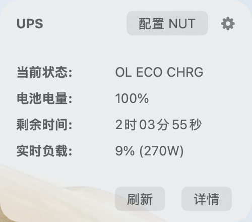
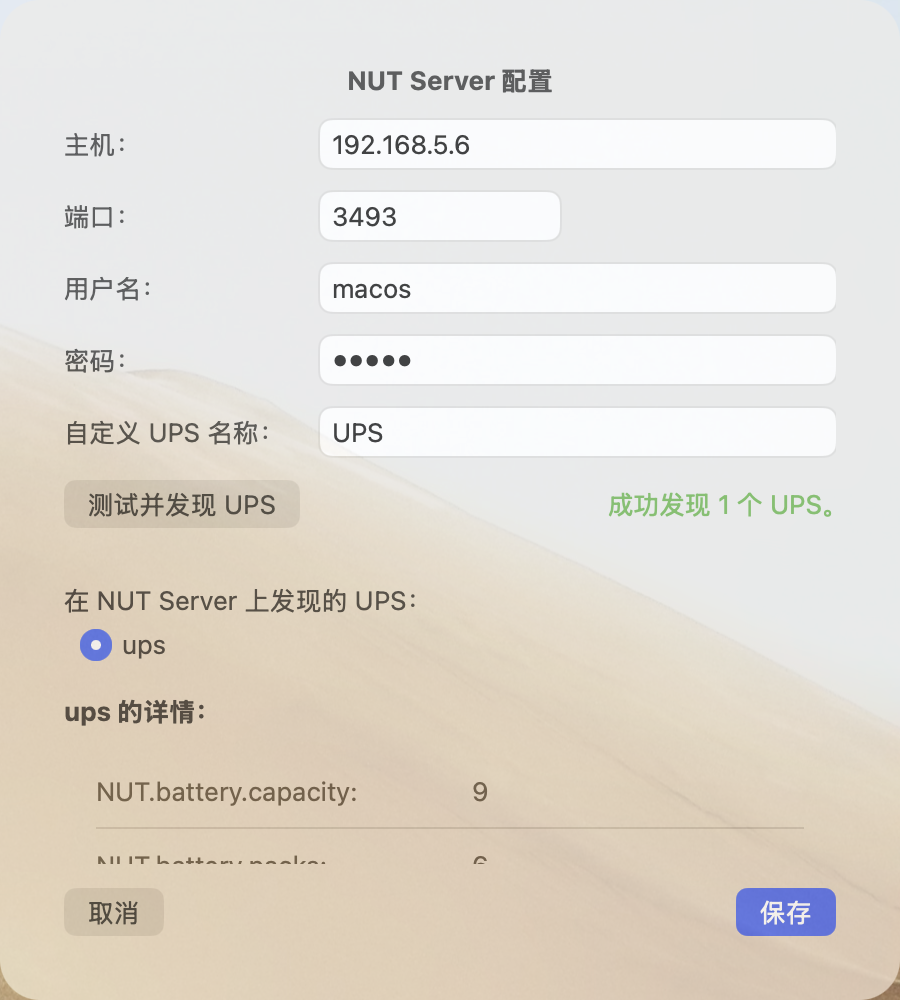

# UPSStatusBar for macOS

A simple macOS status bar application to monitor an Uninterruptible Power Supply (UPS). It can connect to a NUT (Network UPS Tools) server or use the native power source information provided by macOS.

## Features

- **Status Bar Popover**: Click the bolt icon in the status bar to see a quick summary of your UPS status, including charge level, estimated time remaining, and current load.
- **Auto-Refresh**: Data is refreshed automatically every few seconds.
- **Detailed View**: A "Show Details" button to display all available variables from the UPS.
- **NUT Server Support**: Configure the app to connect to a remote NUT server to monitor any UPS on your network.
- **Device Discovery**: Automatically discover available UPS devices on your configured NUT server.
- **Configurable Notifications**: Receive system notifications for important UPS events:
    - Status change (e.g., from Online to On Battery)
    - Battery level drops below a custom threshold
    - Battery becomes fully charged
    - Load exceeds a custom threshold
    - **NUT Server Connection Status**: Get notified when the connection to the NUT server is lost or re-established.
- **Customizable Status Bar Display**: Users can customize which UPS information is displayed in the status bar, such as status icon, charge, time remaining, and load.
- **Launch at Login**: Conveniently set the application to start automatically when you log in to your Mac.
- **Custom Shutdown Action**: When auto-shutdown is triggered, you can choose to execute a custom shell script instead of the default shutdown command.

## Screenshots

**Main Interface**



**Details View**


**NUT Server Configuration**



**Settings (Notifications & Startup)**


## Requirements

- macOS 11.0 or later
- Swift 5.6 or later (or a version of Xcode that includes it)

## How to Build and Run

1.  **Clone the repository.**
2.  **Navigate to the project directory:**
    ```bash
    cd /path/to/repository
    ```
3.  **Build the project:**
    ```bash
    swift build
    ```
4.  **Run the application:**
    ```bash
    swift run UPSStatusBar
    ```
    The application can also be built for release using `swift build -c release`. The final executable will be located in the `.build/release` directory.

    To create a standalone `.app` bundle, you can use the provided shell script:
    ```bash
    ./build_app.sh
    ```
    This will create `UPSStatusBar.app` in the project root directory, which you can then copy to your `/Applications` folder.

## Configuration

- **NUT Server**: Click the "Configure NUT" button in the main popover to set up your NUT server's host, port, and credentials. You can also test the connection and select which UPS to monitor.
- **Notifications & Startup**: Click the gear icon (⚙️) to open the Settings window. Here you can enable or disable different notifications, set thresholds, and toggle the "Launch at Login" option.
