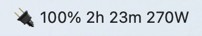

[English Version](README.en.md)

# 适用于 macOS 的 UPSStatusBar

一个简单的 macOS 状态栏应用程序，用于监控不间断电源 (UPS)。它可以连接到 NUT (Network UPS Tools) 服务器，或使用 macOS 提供的原生电源信息。

## 功能

- **状态栏弹窗**: 点击状态栏中的闪电图标，可快速查看 UPS 状态摘要，包括电量、预计剩余时间以及当前负载。
- **自动刷新**: 数据每隔几秒自动刷新。
- **详细视图**: “显示详情”按钮可显示 UPS 的所有可用变量。
- **NUT 服务器支持**: 配置应用程序以连接到远程 NUT 服务器，监控您网络上的任何 UPS。
- **设备发现**: 自动发现您配置的 NUT 服务器上可用的 UPS 设备。
- **可配置通知**: 接收重要 UPS 事件的系统通知：
    - 状态变化（例如，从在线切换到电池供电）
    - 电池电量低于自定义阈值
    - 电池充满电
    - 负载超过自定义阈值
    - **NUT服务器连接状态通知**: 当与NUT服务器的连接断开或重新建立时接收通知。
- **自定义状态栏显示**: 用户可以自定义在状态栏中显示UPS的哪些信息，例如状态图标、电量、剩余时间和负载。
- **开机启动**: 方便地设置应用程序在您登录 Mac 时自动启动。
- **自定义关机操作**: 在自动关机触发时，可以选择执行自定义的shell脚本，而不是默认的关机命令。

## 截图

**状态栏显示**



**主界面**


**详情视图**


**NUT 服务器配置**


**设置（通知与启动）**


## 要求

- macOS 11.0 或更高版本
- Swift 5.6 或更高版本（或包含它的 Xcode 版本）

## 如何构建和运行

1.  **克隆仓库。**
2.  **导航到项目目录：**
    ```bash
    cd /path/to/repository
    ```
3.  **构建项目：**
    ```bash
    swift build
    ```
4.  **运行应用程序：**
    ```bash
    swift run UPSStatusBar
    ```
    应用程序也可以使用 `swift build -c release` 命令以发布模式构建。最终的可执行文件将位于 `.build/release` 目录中。

    要创建一个独立的 `.app` 文件，你可以使用提供的 shell 脚本：
    ```bash
    ./build_app.sh
    ```
    这将在项目根目录中创建 `UPSStatusBar.app`，然后你可以将其复制到你的 `/Applications` 文件夹中。

## 配置

- **NUT 服务器**: 点击主弹窗中的“配置 NUT”按钮，设置您的 NUT 服务器的主机、端口和凭据。您还可以测试连接并选择要监控的 UPS。
- **通知与启动**: 点击齿轮图标 (⚙️) 打开设置窗口。您可以在此处启用或禁用不同的通知，设置阈值，以及切换“开机启动”选项。

---

### 免责声明

请注意：本应用程序尚未经过广泛或重复的测试。请自行承担使用风险，尤其是在启用自动关机等功能时。
